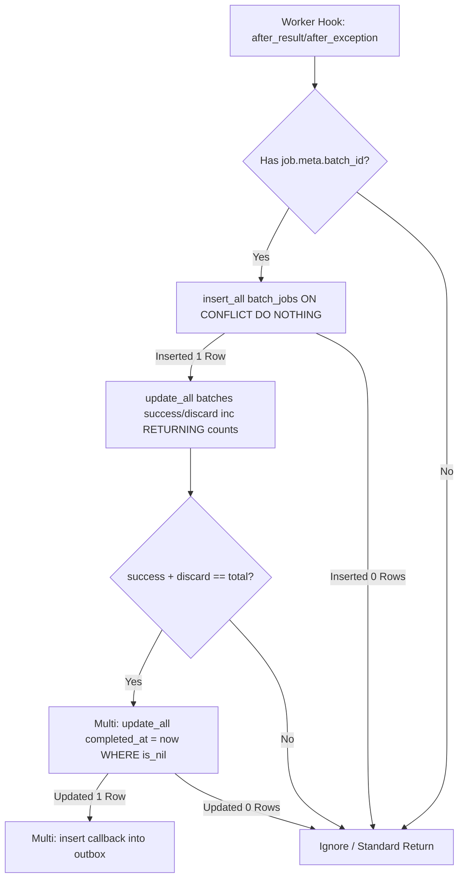

# Phase 60: Execution Engine & Tracker Hooks - Research

**Researched:** 2026-06-14
**Domain:** Elixir/Ecto Transactional Processing & Oban Hooks
**Confidence:** HIGH

## Summary

This phase integrates exactly-once batch progress tracking into the worker lifecycle (`after_result` and `after_exception` hooks). It leverages PostgreSQL atomic operations via Ecto to handle highly concurrent job completions without lock starvation or race conditions, ensuring batch completion safely triggers callbacks.

**Primary recommendation:** Use `Repo.insert_all` with `on_conflict: :nothing` on the `oban_powertools_batch_jobs` table for idempotency, followed by `Repo.update_all(inc: ...)` for lock-free increments, guarded by a final `Ecto.Multi` transaction checking `completed_at` for safe callback insertion.

## Architectural Responsibility Map

| Capability | Primary Tier | Secondary Tier | Rationale |
|------------|-------------|----------------|-----------|
| Exactly-Once Tracking | Database / Storage | API / Backend | Relies on DB-level `UNIQUE` constraints and `INSERT ON CONFLICT DO NOTHING` to guarantee idempotency across BEAM crashes. |
| Counter Increments | Database / Storage | - | Handled entirely in the database via atomic `UPDATE ... SET count = count + 1` to prevent lock starvation. |
| Callback Enqueueing | API / Backend | Database / Storage | The application evaluates the target conditions (`success + discard == total`) and safely enqueues the final callback via an `Ecto.Multi` transaction. |

<user_constraints>
## User Constraints (from CONTEXT.md)

### Locked Decisions
- **D-01:** Prevent double-increments on BEAM crashes using a lightweight `batch_progress` idempotency table (`batch_id`, `job_id`, `state`). *(Note: Phase 59 implemented this as `oban_powertools_batch_jobs`)*
- **D-02:** Execute `INSERT INTO oban_powertools_batch_progress ... ON CONFLICT DO NOTHING` inside the worker hook.
- **D-03:** If the insert succeeds, execute `Repo.update_all(inc: [success_count: 1])` to increment the batch total safely without locking the `batches` table row.
- **D-04:** Handle callback enqueueing directly in the worker hook via a `RETURNING *` clause on the `update_all`.
- **D-05:** If `success_count + discard_count == total_count` and `completed_at` is null, update `completed_at` (acting as a race condition guard) and transactionally insert the callback into `oban_powertools_callbacks`.
- **D-06:** Callbacks are standard Oban Jobs enqueued via the outbox. If a callback exhausts its retries, transition the Batch state to `callback_failed`.
- **D-07:** Surface failed callbacks in the native `/ops/jobs/batches` UI.
- **D-08:** Require the Operator to repair failed callbacks explicitly using the established Lifeline preview/reason/execute pipeline.

### the agent's Discretion
None. All areas resolved via one-shot recommendation.

### Deferred Ideas (OUT OF SCOPE)
None — discussion stayed strictly within the execution engine tracking scope.
</user_constraints>

<phase_requirements>
## Phase Requirements

| ID | Description | Research Support |
|----|-------------|------------------|
| BAT-03 | Exactly-once progress tracking wired transactionally into v1.7 worker lifecycle hooks (`on_success`, `on_discard`). | Research provides `INSERT ON CONFLICT DO NOTHING` patterns with `Ecto.Repo.insert_all` to satisfy exactly-once idempotency. |
| BAT-04 | Execution of `completed` and `exhausted` callbacks via the callback outbox when batch targets are met. | Research provides the `Ecto.Multi` race condition guard pattern for checking targets and safely inserting callbacks. |
</phase_requirements>

## Standard Stack

### Core
| Library | Version | Purpose | Why Standard |
|---------|---------|---------|--------------|
| `ecto_sql` | ~> 3.10 | Database queries and atomic operations | Core Elixir ecosystem library for robust, transaction-safe database interactions. |
| `oban` | existing | Job processing engine | Established project framework with worker lifecycle hooks available. |

## Package Legitimacy Audit

> **No external packages introduced in this phase.** Only relying on existing project dependencies (`ecto_sql`, `oban`).

## Architecture Patterns

### System Architecture Diagram



### Pattern 1: Ecto Idempotent Inserts
**What:** Using `Repo.insert_all` with `on_conflict: :nothing` to guarantee exactly-once tracking.
**When to use:** Tracking job completions in a batch to avoid double counting if the BEAM node restarts mid-execution.
**Example:**
```elixir
{count, _} =
  repo.insert_all(
    ObanPowertools.BatchJob, # This schema serves as the "batch_progress" idempotency table
    [
      %{
        batch_id: batch_id,
        job_id: job_id,
        state: to_string(state),
        inserted_at: now,
        updated_at: now
      }
    ],
    on_conflict: :nothing
  )
# If count == 1, it's safe to increment the batch total
```

### Pattern 2: Atomic Updates with RETURNING
**What:** Using `Ecto.Repo.update_all` with `select:` and `inc:` to increment counts without row-level read locks.
**When to use:** Updating aggregated counters dynamically under heavy concurrent load.
**Example:**
```elixir
{1, [batch]} =
  repo.update_all(
    from(b in ObanPowertools.Batch,
      where: b.id == ^batch_id,
      update: [inc: [{^inc_field, 1}]],
      select: b
    ),
    []
  )
```

## Don't Hand-Roll

| Problem | Don't Build | Use Instead | Why |
|---------|-------------|-------------|-----|
| Idempotency checking | `Repo.get` followed by `Repo.insert` | `Repo.insert_all(..., on_conflict: :nothing)` | `Repo.get` leaves a race condition window during highly concurrent job completions. |
| DB Locks for counters | Ecto Changesets with optimistic locking (`lock_version`) | `Repo.update_all` with `inc:` | Optimistic locks lead to massive transaction retries and starvation under high concurrency. Database atomic increments are faster and safer. |

## Common Pitfalls

### Pitfall 1: Relying on `Repo.insert(..., on_conflict: :nothing)` return value
**What goes wrong:** `Repo.insert/2` doesn't reliably indicate whether a row was ignored or inserted when not using an auto-increment integer ID.
**Why it happens:** Ecto adapter quirks with single inserts and conflict resolution when UUIDs are involved.
**How to avoid:** Use `Repo.insert_all/3` which definitively returns `{count, _}`, ensuring `count == 1` perfectly maps to a new insertion.

### Pitfall 2: Race Conditions on Callback Enqueueing
**What goes wrong:** Multiple workers finishing their batch jobs simultaneously might all see `success_count == total_count` and enqueue duplicate callbacks.
**Why it happens:** The atomic increment happens first, and the evaluation happens second. Both workers receive the identical `batch` struct with the fulfilled target counts.
**How to avoid:** Enforce D-05 tightly. Use an `Ecto.Multi` that issues a second `update_all` guarded by `where: is_nil(completed_at)`. Only the single worker that successfully updates `completed_at` is allowed to insert the callback.

## Environment Availability

Step 2.6: SKIPPED (no external dependencies identified; purely backend Elixir logic interacting with the existing Postgres database)

## Validation Architecture

### Test Framework
| Property | Value |
|----------|-------|
| Framework | ExUnit |
| Config file | `test/test_helper.exs` |
| Quick run command | `mix test test/oban_powertools/batch/tracker_test.exs` |
| Full suite command | `mix test` |

### Phase Requirements → Test Map
| Req ID | Behavior | Test Type | Automated Command | File Exists? |
|--------|----------|-----------|-------------------|-------------|
| BAT-03 | Exactly-once progress tracking | unit | `mix test test/oban_powertools/batch/tracker_test.exs` | ❌ Wave 0 |
| BAT-04 | Callback outbox enqueuing on completion | unit | `mix test test/oban_powertools/batch/tracker_test.exs` | ❌ Wave 0 |

### Sampling Rate
- **Per task commit:** `mix test test/oban_powertools/batch/tracker_test.exs`
- **Per wave merge:** `mix test`
- **Phase gate:** Full suite green before `/gsd:verify-work`

### Wave 0 Gaps
- [ ] `lib/oban_powertools/batch/tracker.ex` — New core tracking module logic
- [ ] `test/oban_powertools/batch/tracker_test.exs` — Test suite for idempotency and race-condition guards

## Security Domain

### Applicable ASVS Categories

| ASVS Category | Applies | Standard Control |
|---------------|---------|-----------------|
| V2 Authentication | no | - |
| V3 Session Management | no | - |
| V4 Access Control | no | - |
| V5 Input Validation | yes | Ecto query boundaries correctly type-cast inputs (e.g. `batch_id` as UUID). |
| V6 Cryptography | no | - |

### Known Threat Patterns for Elixir/Postgres

| Pattern | STRIDE | Standard Mitigation |
|---------|--------|---------------------|
| Resource Exhaustion (Lock Starvation) | Denial of Service | Avoid `SELECT FOR UPDATE` or application-level locks on the `batches` table; rely strictly on `UPDATE ... SET count = count + 1` via `Repo.update_all`. |

## Sources

### Primary (HIGH confidence)
- `.planning/phases/60-execution-engine-tracker-hooks/60-CONTEXT.md` - Locked architectural decisions.
- `.planning/REQUIREMENTS.md` - Phase constraints.
- [Ecto.Repo Documentation](https://hexdocs.pm/ecto/Ecto.Repo.html#c:insert_all/3) - `insert_all` behavior with `on_conflict: :nothing`.

## Metadata

**Confidence breakdown:**
- Standard stack: HIGH - Core Elixir/Ecto mechanics.
- Architecture: HIGH - Fully adheres to explicit constraints in CONTEXT.md.
- Pitfalls: HIGH - Idempotency and race condition handling explicitly mandated by architecture design.

**Research date:** 2026-06-14
**Valid until:** 2026-07-14
